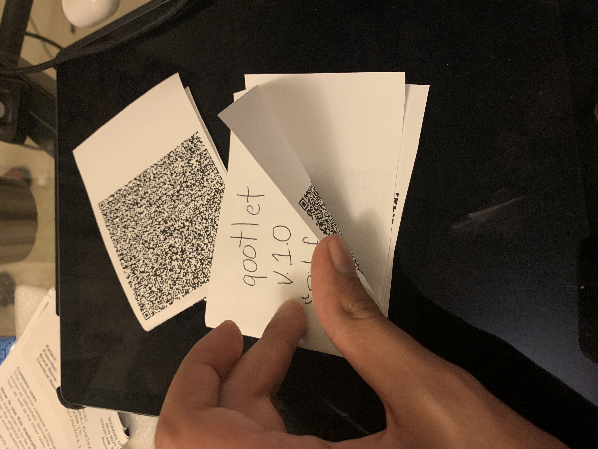

# qootlet

Qootlet encodes arbitrary amounts of data in QR codes by chaining them together.
A very simple header is added to each QR identifying which chunk it is the series.
The reader assembles the chunks and recreates the original data. The chunks do not
have to be read in order.

<h2 align="center"><a  href="https://qootlet.sinakhalili.com">Live Demo</a></h2> (as opposed to dead one?)

## Usage

Uploading a file will spit out a bunch of QR codes. Right-click `save-as` to save the images.

Now you can do what you wish with these images.
The namesake of the project is to print them and put them
in a nice little booklet, so that you can take it around and share good.
Love it like your own booklet (you would never tell the booklet it's true origins).

    

The problem with this method (other than knowing deep down, the booklet will one day see you die) is
that it's pretty tedious to scan the booklet (especially if it's a lot of pages).

So Instead, you can save the images as a gif (maybe using something like [ezgif](https://ezgif.com/maker))

Now you can read back the data super fast! Give it a few loops :ok_hand:

(like a good non-fiction book, the chunks don't have to be read in order)

    

## Projects used: (I am eternally grateful)

- [jsQR](https://github.com/cozmo/jsQR) 👉 For reading the QR code
- [node-qrcode](https://github.com/soldair/node-qrcode) 👉 For the QR code creator
- [FileSaver.js](https://github.com/eligrey/FileSaver.js) 👉 For saving files to the user's computer

### Projects not used but acted as inspiration which is also really important:

- [Make an Atari 2600 that plays QR codes](https://www.codedojo.com/?p=2251) 👉 I originally wanted to make the reader automatically play the game using this cool javascript atari emulator called [javatari](https://github.com/ppeccin/javatari)
- [Can you fit a game in a QR code (video)](https://www.youtube.com/watch?v=ExwqNreocpg&t=2s) 👉 A cool video about this mans trying to fit a game into a QR code
- [QR code article](https://a16z.com/2019/10/30/the-power-of-qr-codes/) 👉 Kinda interesting to see what people are doing with QR.

### Other interesting use of QR

- [QR codes with gifs!](https://github.com/sylnsfar/qrcode)
